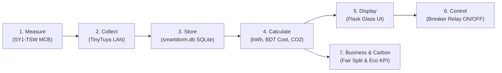

# SmartDorm — IoT-Based Smart Sub-Metering & Energy Management System

An end-to-end, local-first IoT energy sub-metering, analytics, and circuit breaker management platform designed for student dormitories and shared housing facilities in Bangladesh.

SmartDorm interfaces directly with Tuya-based smart miniature circuit breakers (MCBs) over the local area network (LAN) without relying on external cloud services. It provides real-time electrical telemetry, automated data logging, fair consumption-based sub-billing allocation, carbon footprint accounting, and remote circuit breaker control.

---

## 📑 Table of Contents

- [Overview](#-overview)
- [Key Features](#-key-features)
- [System Architecture](#-system-architecture)
- [Hardware & Telemetry DPS Mapping](#-hardware--telemetry-dps-mapping)
- [File Structure](#-file-structure)
- [Installation & Setup](#-installation--setup)
- [Configuration](#-configuration)
- [Running the System](#-running-the-system)
- [Web Dashboard & Interfaces](#-web-dashboard--interfaces)
- [REST API Reference](#-rest-api-reference)
- [Billing & Calculation Algorithms](#-billing--calculation-algorithms)
- [License & Authors](#-license--authors)

---

## ⚡ Overview

In traditional student housing and dormitories, utility bills are typically split equally among occupants regardless of individual consumption habits. This creates split-incentive problems, unfair cost burdens on low-power users, and unchecked energy wastage.

**SmartDorm** addresses this by:
1. Monitoring per-room electrical parameters (Voltage, Current, Power, Energy kWh) in real time.
2. Storing high-resolution historical telemetry in a local SQLite database.
3. Calculating fair, consumption-based sub-bills versus traditional equal splits.
4. Enabling remote and emergency circuit breaker trip/switch operations.
5. Operating completely over local LAN via the TinyTuya protocol (no cloud latency, subscription fees, or internet dependency).

---

## ✨ Key Features

- **Local LAN IoT Operation**: Communicates directly with smart breakers over local Wi-Fi using TinyTuya (Tuya Protocol v3.5). No Tuya Cloud dependency or vendor lock-in.
- **Real-Time Telemetry & Monitoring**: Tracks Voltage ($V$), Current ($A$), Active Power ($W$), Cumulative Energy ($kWh$), breaker state, and device faults at configurable polling intervals (default: 10 seconds).
- **Sub-Process Collector Controller**: The web interface can start, stop, and monitor the standalone data collector daemon in real time, streaming live stdout logs and status metrics.
- **Fair Sub-Billing Engine**: Dynamically calculates each room's exact percentage share of total energy used, compares fair billing vs. flat equal splits, and identifies cross-subsidies.
- **Carbon Footprint Tracking**: Converts energy consumption into carbon emissions based on Bangladesh's grid emission factor ($0.65\text{ kg CO}_2/\text{kWh}$).
- **Remote MCB Breaker Control**: Direct ON/OFF toggle for individual room breakers or a global "All-Off" emergency shutdown command.
- **Historical Trends & Analytics**: Daily, monthly, and yearly aggregated energy consumption charts with peak load identification using Chart.js.
- **Dark Glassmorphic UI**: Fast, responsive Bootstrap 5 interface with real-time UI polling and interactive visualizations.
- **Remote Access (Optional)**: Built-in `pyngrok` support for secure remote tunneling over public HTTPS when outside the dormitory LAN.

---

## 🏗 System Architecture

SmartDorm operates across a 7-stage pipeline:



### Architectural Components

1. **Hardware Layer**: `SY1-TSW` Wi-Fi Smart Miniature Circuit Breakers (MCBs) installed on individual room distribution boards.
2. **Data Ingestion Daemon (`data_collector.py`)**: Standalone Python process running a non-blocking collection loop that polls smart meters every 10 seconds and saves raw values into SQLite.
3. **Database Layer (`database.py`)**: SQLite storage (`smartdorm.db`) with composite indices for rapid time-series querying, daily aggregations, and cumulative delta-kWh computations.
4. **Application & Control Server (`smartdorm_11.py`)**: Flask web server serving interactive dashboards, REST APIs, background collector process management, and bi-directional hardware switching.

---

## 🔌 Hardware & Telemetry DPS Mapping

The system interfaces with Tuya `SY1-TSW` DIN-rail smart circuit breakers (category `dlq`) using the following Data Point (DPS) definitions:

| DPS Key | Data Point Name | Raw Type | Scaling Factor | Engineering Unit | Description |
|---|---|---|---|---|---|
| `1` | `switch` | Boolean | Direct | `True / False` | Main MCB circuit breaker state (Relay ON/OFF) |
| `17` | `add_ele` | Integer | $\div 1000$ | $\text{kWh}$ | Cumulative forward active energy counter |
| `18` | `cur_current` | Integer | $\div 1000$ | $\text{A}$ (Amperes) | RMS electric current |
| `19` | `cur_power` | Integer | $\div 10$ | $\text{W}$ (Watts) | Active power draw |
| `20` | `cur_voltage` | Integer | $\div 10$ | $\text{V}$ (Volts) | RMS line voltage |
| `26` | `fault` | Integer / Bitmap | Direct | Fault Code | Hardware fault indicators / protection trips |
| `66` | `online` | String / Enum | Direct | `online / offline` | Network communication status |

---

## 📁 File Structure

```text
SmartDorm/
├── data_collector.py     # Standalone LAN polling daemon (TinyTuya -> SQLite)
├── database.py           # SQLite database schema, connections, and analytical queries
├── smartdorm_11.py       # Main Flask application, Web UI, Collector Controller & APIs
├── devices.json          # Hardware device profiles (Device ID, Local Key, IP, MAC)
├── smartdorm.db          # SQLite database (auto-generated on first run)
├── ngrok_authtoken.txt   # (Optional) ngrok authtoken for remote access tunneling
└── README.md             # Project documentation
```

---

## 🚀 Installation & Setup

### 1. Prerequisites
- Python 3.8 or higher
- All host machines and smart meters connected to the same local Wi-Fi network (2.4 GHz for Tuya devices).

### 2. Clone the Repository
```bash
git clone https://github.com/your-username/SmartDorm.git
cd SmartDorm
```

### 3. Create a Virtual Environment
```bash
python3 -m venv venv
source venv/bin/activate  # On Windows: venv\Scripts\activate
```

### 4. Install Dependencies
```bash
pip install flask tinytuya pandas numpy pyngrok
```

---

## ⚙️ Configuration

### 1. Device Provisioning (`devices.json`)
Extract your local Tuya device keys using the [TinyTuya Scan/Wizard tool](https://github.com/jasonacox/tinytuya) (`python -m tinytuya wizard`) and save them in `devices.json`:

```json
[
  {
    "name": "Room F",
    "id": "bfbdf64a96838294f4tabw",
    "key": "YOUR_LOCAL_KEY_HERE",
    "ip": "192.168.0.101"
  },
  {
    "name": "Room K",
    "id": "bf12b5a475e54ca3068byh",
    "key": "YOUR_LOCAL_KEY_HERE",
    "ip": "192.168.0.100"
  }
]
```

### 2. System Constants (Adjustable in `smartdorm_11.py`)
- `DEFAULT_ELECTRICITY_RATE`: Default tariff in Bangladeshi Taka ($12.50\text{ BDT/kWh}$).
- `DEFAULT_CARBON_FACTOR`: Emission intensity ($0.65\text{ kg CO}_2/\text{kWh}$).
- `INTERVAL_SECONDS`: Polling frequency (default: $10\text{ seconds}$).
- `DEFAULT_BILLING_DAYS`: Trailing evaluation window (default: $30\text{ days}$).

---

## 💻 Running the System

### Option A: Integrated Web App Mode (Recommended)
Launch the Flask application. You can manage the data collector directly from the web interface under **System Settings** or the **Overview Dashboard**.

```bash
python smartdorm_11.py
```
Open your browser at:
- **Local:** `http://127.0.0.1:5000`
- **LAN:** `http://<YOUR_PC_LOCAL_IP>:5000`

### Option B: Standalone Polling Daemon
If you prefer running the background telemetry collector as a separate process or systemd service:

```bash
# Terminal 1: Run Data Collector
python data_collector.py

# Terminal 2: Run Web Dashboard
python smartdorm_11.py
```

### Option C: Remote Tunneling with ngrok
To make the dashboard accessible outside the local network:
1. Provide your token in `ngrok_authtoken.txt` or set the `NGROK_AUTHTOKEN` environment variable:
   ```bash
   export NGROK_AUTHTOKEN="your_ngrok_token"
   ```
2. Start `smartdorm_11.py`. The console will display your secure public URL:
   ```text
   [NGROK] Public URL: https://xxxx-xx-xx.ngrok-free.app -> http://127.0.0.1:5000
   ```

---

## 🖥 Web Dashboard & Interfaces

| Page Route | Interface Name | Purpose |
|---|---|---|
| `/` | **Landing Page** | System introduction, pipeline overview, and quick entry links. |
| `/dashboard` | **Overview Command Center** | Real-time KPI summary (Total Power, Energy, Cost, Carbon), active room cards, quick breaker switches, and live collector process log stream. |
| `/analytics` | **Analytics & Trends** | Interactive daily, monthly, and yearly consumption charts, peak power analysis, and room-level share breakdowns. |
| `/billing` | **Sub-Billing Center** | Fair billing calculator comparing actual consumption split vs. traditional equal split, customizable invoice totals, and difference analysis. |
| `/carbon` | **Carbon Impact Tracker** | Room-level carbon emissions ranking, highest/lowest emitter identification, and environmental sustainability insights. |
| `/history` | **Historical Records** | Historical data table viewer, daily aggregated metrics, and sample count audit. |
| `/control` | **Circuit Breaker Control** | Dedicated MCB control station with individual ON/OFF switches and Master Emergency All-Off breaker control. |
| `/settings` | **System & Diagnostics** | Tariff configuration, database statistics, device status audit, and collector daemon process controller. |

---

## 📡 REST API Reference

### Real-Time Telemetry & Control

| Endpoint | Method | Parameters | Description |
|---|---|---|---|
| `/api/rooms` | `GET` | — | Returns the latest electrical readings and switch states for all configured rooms. |
| `/api/summary` | `GET` | `days` (optional, default `180`) | Aggregate energy, active power, estimated cost (BDT), and carbon footprint. |
| `/api/control/<dev_id>` | `POST` | JSON: `{"switch": true/false}` | Actuates the physical MCB relay (DPS 1) for the specified device over LAN. |
| `/api/control/all-off` | `POST` | — | Emergency shutdown: Turns off all circuit breakers simultaneously. |

### Analytics & Accounting

| Endpoint | Method | Parameters | Description |
|---|---|---|---|
| `/api/analytics` | `GET` | `period` (`daily`, `monthly`, `yearly`) | Time-bucketed energy data, room-by-room breakdown, and peak power. |
| `/api/billing` | `GET` | `days`, `total_bill` (optional) | Calculates equal split vs. consumption-based split and per-room delta. |
| `/api/carbon` | `GET` | `days` (optional) | Carbon emissions breakdown per room in $\text{kg CO}_2$. |
| `/api/history/daily` | `GET` | `days`, `device_id` (optional) | Daily aggregated energy usage and average voltages. |

### Collector Daemon & Database Health

| Endpoint | Method | Parameters | Description |
|---|---|---|---|
| `/api/collector/status` | `GET` | — | Returns collector running state, PID, uptime, total saved records, and recent logs. |
| `/api/collector/start` | `POST` | — | Spawns `data_collector.py` as a managed background subprocess. |
| `/api/collector/stop` | `POST` | — | Gracefully stops the collector subprocess. |
| `/api/database` | `GET` | — | Returns total records stored, distinct device count, and timestamp range. |

---

## 🧮 Billing & Calculation Algorithms

### 1. Cumulative Energy Delta
Because hardware counters increment continuously, consumption across any time window is calculated strictly using cumulative energy deltas to prevent sample-rate drift:

$$\Delta E_{room} = \max\left(0, E_{\text{latest}} - E_{\text{earliest}}\right) \quad (\text{kWh})$$

### 2. Fair Consumption-Based Sub-Billing
For a total utility electricity bill $B_{\text{total}}$ and $N$ rooms:

$$\text{Share Proportion } S_i = \frac{\Delta E_i}{\sum_{k=1}^N \Delta E_k}$$

$$\text{Consumption Split Bill } B_i = B_{\text{total}} \times S_i$$

$$\text{Equal Split Bill } B_{\text{equal}} = \frac{B_{\text{total}}}{N}$$

$$\text{Financial Difference } \Delta B_i = B_i - B_{\text{equal}}$$

- $\Delta B_i > 0$: Room consumed more than average (previously under-paying in equal split).
- $\Delta B_i < 0$: Room consumed less than average (receives fair savings under SmartDorm).

### 3. Carbon Emissions
$$C_i = \Delta E_i \times 0.65\text{ kg CO}_2/\text{kWh}$$

---

## 📄 License & Authors

- **Project**: SmartDorm — IoT-Based Smart Sub-Metering System for Bangladeshi Student Dormitories
- **Capstone / Research Project**
- **License**: MIT Open Source License

---
*Built with Python, Flask, TinyTuya, SQLite, Chart.js, and Bootstrap 5.*
